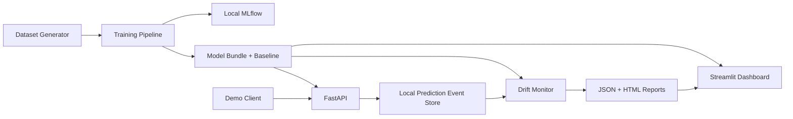
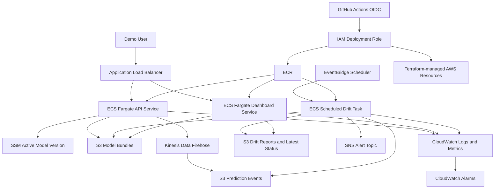

# ModelGuard AI — Architecture

## 1. Design principles

1. Small enough to finish, broad enough to prove full-cycle ownership.
2. Local behavior and AWS behavior use the same application interfaces.
3. Managed AWS services replace unnecessary custom infrastructure.
4. No EKS in the MVP; ECS Fargate is proportionate to the problem.
5. No automatic retraining; detection, evidence, and controlled promotion are safer portfolio behavior.
6. Every component must have an explicit failure mode and health signal.

## 2. Local architecture



## 3. AWS architecture



## 4. Prediction contract

Requests are bounded and schema-strict. `input_schema.json` in the verified bundle is the canonical
feature contract; Phase 02 freezes the exact numeric bounds, categorical domains, nullability, and
feature order, and later phases consume rather than redefine it. The field names and core types in
the example below are normative. Numeric inputs are finite, risk scores are in `[0,1]`, counts and
distances are non-negative, and `transaction_hour` is an integer in `[0,23]`. The score is finite in
`[0,1]`; `decision` is `high_risk` when `score >= locked_threshold`, otherwise `low_risk`.

Local mode may be open. Every AWS deployment restricts the ALB to an explicit non-world CIDR. Two
AWS access modes are allowed:

- `https_token`: ACM HTTPS plus `Authorization: Bearer <token>` on `POST /v1/predict`, checked in
  constant time. The token comes from a pre-created SSM SecureString referenced by ARN; its value
  never enters Terraform inputs/state/outputs, logs, screenshots, or evidence.
- `http_cidr_only`: short-lived synthetic-only fallback with no reusable token transmitted and no
  secure-transport/authentication claim.

`/health/live` and `/health/ready` are token-exempt for ALB health checks and return minimal status.
`/metrics` is not publicly routed in AWS. `/version` and the dashboard remain CIDR-restricted; the
dashboard has no mutation controls. Tasks have no public IP. The demo spans two AZs, desired count
one per service, one documented non-HA NAT, and an S3 gateway endpoint; it is not an HA service.

Example request:

```json
{
  "amount": 4200.0,
  "transaction_hour": 2,
  "velocity_1h": 8,
  "distance_from_home_km": 180.0,
  "device_risk_score": 0.82,
  "merchant_risk_score": 0.64,
  "is_new_device": true,
  "country_code": "EG",
  "device_type": "mobile"
}
```

Example response:

```json
{
  "request_id": "uuid",
  "risk_score": 0.8731,
  "decision": "high_risk",
  "model_version": "1.0.0",
  "latency_ms": 14.8
}
```

## 5. Model bundle

A model bundle is immutable and should contain:

```text
model-bundles/<version>/
├── model.joblib
├── manifest.json
├── input_schema.json
├── metrics.json
├── threshold.json
├── baseline_profile.json
└── checksums.sha256
```

Durable model identity is `{model_version, manifest_sha256}` plus S3 VersionIds when available. A
publisher refuses an existing version path and verifies the uploaded bytes before promotion. The
active and previous identities are stored separately in local configuration or an SSM pointer.
Promotion changes the pointer, not the immutable bundle. An API task snapshots the pointer at
startup, verifies and loads the bundle once, and becomes ready afterward; promotion/rollback forces
a controlled ECS deployment rather than hot reload. Manifest lineage covers dataset, persisted
split, schema, baseline, source tree/Git revision, config, dependency lock, and MLflow run.

The AWS API and one-shot monitor hydrate the bundle into an empty writable runtime volume using the
task role/default SDK credential chain. They request every object by the exact VersionId recorded in
the pointer, enforce an exact filename set and bounded object sizes, verify returned identities,
checksums, schema/version/manifest lineage, and cross-artifact consistency, and only then permit
trusted deserialization. A same-filesystem rename publishes the verified directory atomically.
Interrupted, mixed-version, substituted, corrupt, or partial downloads are removed and cannot make
the API ready or produce a successful monitor result.

## 6. Monitoring logic

### Numeric features
- Frozen training-reference bins; PSI with epsilon `1e-6`, renormalization, and natural log.
- Guard against zero/constant bins, non-finite values, and tiny samples.
- Store score, threshold, sample size, and severity.

### Categorical features
- Baseline and current probability distributions share a complete category universe including `__OTHER__`.
- Jensen-Shannon distance (square root of base-2 divergence) over the full universe.

### Run/window contract
- Use event-time UTC half-open `[start,end)`. Do not finalize before `as_of >= end + grace`; grace is
  a closing delay, not a row-level delivery-lateness claim. Freeze the enumerated input snapshot at
  run start and use Firehose/S3 freshness telemetry for delivery delay.
- Snapshot one explicit target `{event schema, model version, manifest digest, input schema}` per
  run (CLI locally; SSM once at AWS run start). Derive the baseline identity from its verified
  bundle and hash monitoring configuration once at run start.
- Classify exclusively in this order: parse/schema, event-time window, identity, then target-event
  deduplication. Known non-target model identities are counted and excluded; unknown/conflicting
  identities invalidate data quality. Identical target duplicates accept one and count the rest as
  duplicates; a conflicting ID group rejects every record in the group.
- Reconcile record counts exactly as
  `raw = rejected + outside_window + known_non_target + duplicate + accepted_target`.
- Canonical report IDs hash the window/target/config plus sorted canonical selected-record and label
  digests, independent of file names, file boundaries, enumeration order, or mutable container-file
  hashes. Historical reports are immutable; `latest` updates atomically only to a newer window.
  Conditional transition markers suppress routine duplicate alerts without claiming exactly-once
  SNS delivery.
- The scheduled AWS entry point is `aws-run`, which performs exactly one cycle and exits. It does
  not daemonize. It freezes the SSM target and bounded S3 object identities once, evaluates the same
  pure contract as local monitoring, writes immutable history/latest/run-status records with
  conditional operations, emits bounded EMF to stderr and one canonical JSON result to stdout, and
  uses distinct exit codes for invalid configuration, AWS access, incomplete evidence, and
  persistence/alert failures.

### Independent dimensions
- Run: `never_run | succeeded | failed | stale`.
- Data quality: `valid | warning | invalid | insufficient_data`.
- Drift: `healthy | warning | degraded | unknown`.
- Performance: `healthy | warning | degraded | pending_labels | unknown`.

Run precedence is current failure, then never-run, then stale latest success, then succeeded. Hard
identity/reconciliation/conflicting-ID faults make data quality invalid; otherwise insufficient
target volume precedes warning and valid. Known non-target traffic and benign duplicates warn.
Invalid or insufficient data forces drift unknown; otherwise drift is the maximum required-signal
severity and is healthy only when every required signal is evaluable below warning.

Performance needs adequate labels joined locally by event ID. Phase 02 records held-out
`synthetic_cost_per_event = (10 * FN + FP) / N_test` after locking the threshold. On an adequate
labeled subset the monitor computes the same locked-policy cost and `cost_delta = current - test`:
healthy `<0.10`, warning `>=0.10 and <0.25`, degraded `>=0.25`. Other label-backed metrics are
diagnostic, not state voters. This is a versioned synthetic-demo heuristic, not a significance test,
full-window guarantee, real-world economic claim, or proof that drift caused a performance change.

## 7. Failure behavior

- Model cannot load: readiness fails; liveness remains available where practical.
- Firehose unavailable: prediction succeeds, event failure is logged and counted.
- S3 report unavailable: dashboard shows stale/unknown state, not healthy.
- AWS dashboard source permission, Region, endpoint, response, or partial-outage failures are shown
  as explicit degraded/unavailable source health and never converted into a healthy report claim.
- Small sample: data quality is `insufficient_data`, drift is `unknown`, never healthy.
- ECS health failure targets recorded last-known-good task state. Model-pointer rollback is separate;
  drift alone never rolls back a model.
- Invalid model bundle checksum/schema: promotion is blocked.

## 8. Deployment and telemetry contracts

Initial AWS deployment uses two separately reviewed saved plans, never ad hoc `terraform -target`:

1. Apply prerequisites with API/dashboard desired count zero and the monitor schedule disabled.
2. Build/scan/push every image once, resolve its ECR digest, publish and verify the immutable model
   bundle, set the exact active pointer, and verify any required SecureString reference.
3. Apply an activation plan using `repository@sha256:...`, then run readiness and smoke checks.

Bootstrap owns remote state, GitHub OIDC roles, and the mandatory permission boundary; demo deploy
roles cannot modify that trust boundary. Deployment roles can create only bounded workload roles
under the boundary, and `iam:PassRole` is limited to exact roles and services.

Human governance is selected explicitly:

- `team_protected` retains protected `main`, a real independent required reviewer, prevention of
  self-review, no administrator bypass, and exact environment/OIDC claims.
- `solo_portfolio` is a disclosed portfolio-only mode with no independent approval and no
  production-grade separation of duties. Before Actions or public Code Scanning can be enabled the
  repository must be Public. Privileged entry is manual, source/image/saved-plan identities and
  typed phrases are exact, plan and deploy roles remain separate, the deploy role never trusts
  `demo-plan`, lifetime is bounded, and destroy is separately confirmed. Any missing evidence
  refuses the action. When a real trusted reviewer becomes available, the repository must upgrade
  to `team_protected`; automation does not count as that reviewer.

The retained `modelguard-ai-demo-monthly` AWS Budget is a manual account prerequisite at USD 10 with
50%, 80%, and 100% actual plus 100% forecast alerts. The operator enters its endpoint only in the AWS
Console. Terraform, workflows, state, plans, reports, logs, commands, and project configuration carry
neither the endpoint nor any substitute. The read-only preflight checks only the budget identity and
threshold contract and never queries subscriber endpoints. Budget alerts do not stop spending.

CloudTrail state-object auditing is also retained outside the demo lifecycle. The independent
`infrastructure/audit-bootstrap` root targets only the two exact future state and lock object ARNs,
uses a private versioned KMS-encrypted log bucket, public-access blocking, TLS-only delivery,
log-file validation, finite lifecycle retention, least-privilege service conditions, and
`prevent_destroy`. Its initial local state requires encrypted offline preservation before any later
apply. CloudTrail, KMS, and S3 usage can incur cost and finite retention limits recovery.

`/metrics` is the local/test Prometheus surface. AWS alarms use native ALB/Firehose/Scheduler metrics
and a small fixed set of low-cardinality EMF events written to stdout for application/monitor signals.
Request IDs, event IDs, tokens, features, and arbitrary model versions are never metric dimensions.
Scheduler submission success is not monitor-task completion; the monitor emits a completion and
freshness heartbeat. The Phase 08 alarm matrix must name a producible source for every alarm.

## 9. Target repository tree

```text
.
├── AGENTS.md
├── README.md
├── PROJECT_SPEC.md
├── ARCHITECTURE.md
├── ACCEPTANCE_CRITERIA.md
├── contracts/
│   └── prediction-event-v1.schema.json
├── pyproject.toml
├── uv.lock
├── Makefile
├── .env.example
├── docker-compose.yml
├── src/modelguard/
│   ├── api/
│   │   ├── main.py
│   │   ├── dependencies.py
│   │   ├── schemas.py
│   │   └── routes.py
│   ├── core/
│   │   ├── config.py
│   │   ├── logging.py
│   │   └── telemetry.py
│   ├── data/
│   │   ├── generator.py
│   │   ├── schema.py
│   │   └── validation.py
│   ├── training/
│   │   ├── pipeline.py
│   │   ├── evaluate.py
│   │   ├── bundle.py
│   │   └── cli.py
│   ├── inference/
│   │   ├── loader.py
│   │   ├── predictor.py
│   │   └── events.py
│   ├── monitoring/
│   │   ├── profile.py
│   │   ├── drift.py
│   │   ├── report.py
│   │   ├── state.py
│   │   └── cli.py
│   ├── dashboard/
│   │   ├── app.py
│   │   └── repository.py
│   └── storage/
│       ├── base.py
│       ├── local.py
│       └── aws.py
├── tests/
│   ├── unit/
│   ├── contract/
│   ├── integration/
│   └── smoke/
├── artifacts/
│   └── .gitkeep
├── docker/
│   ├── api.Dockerfile
│   ├── dashboard.Dockerfile
│   └── monitor.Dockerfile
├── infrastructure/
│   ├── bootstrap/
│   ├── modules/
│   └── environments/demo/
├── .github/workflows/
├── scripts/
├── docs/
├── prompts/
├── checklists/
└── reports/
```

## 10. Architectural decision records

See `docs/adr/` for the decisions that protect scope and explain trade-offs.
