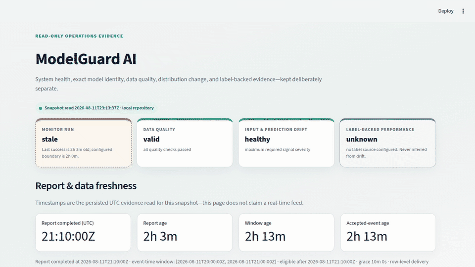
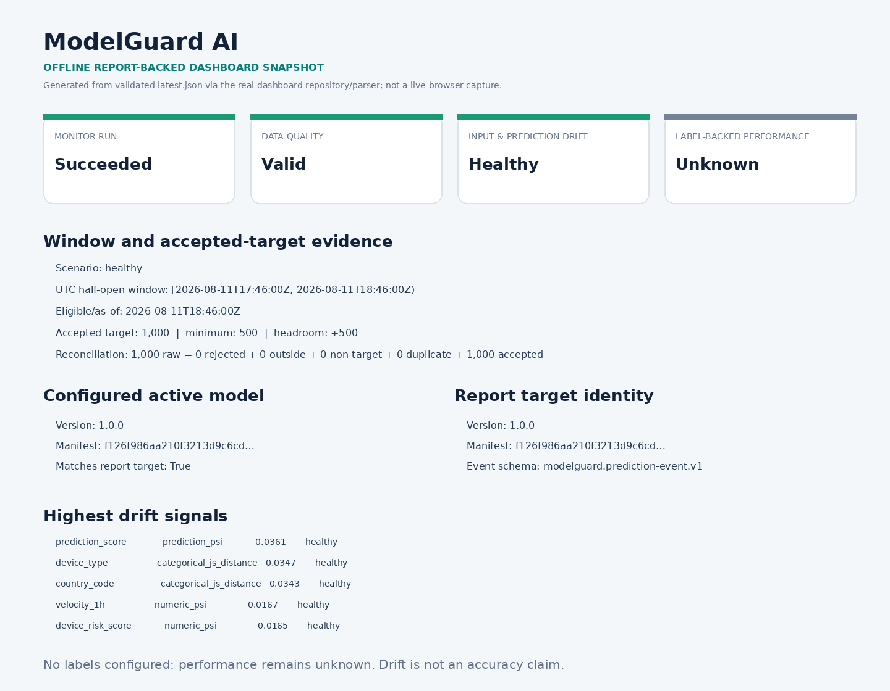
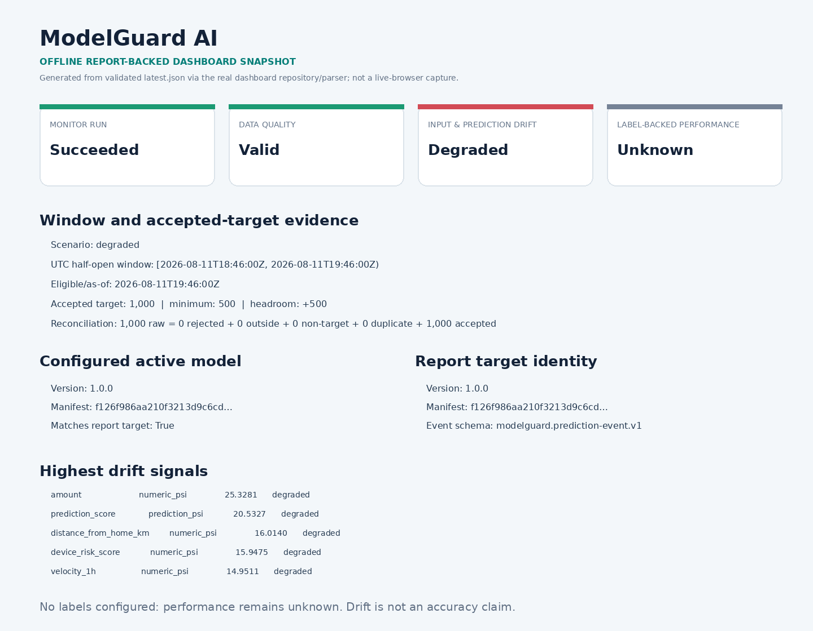
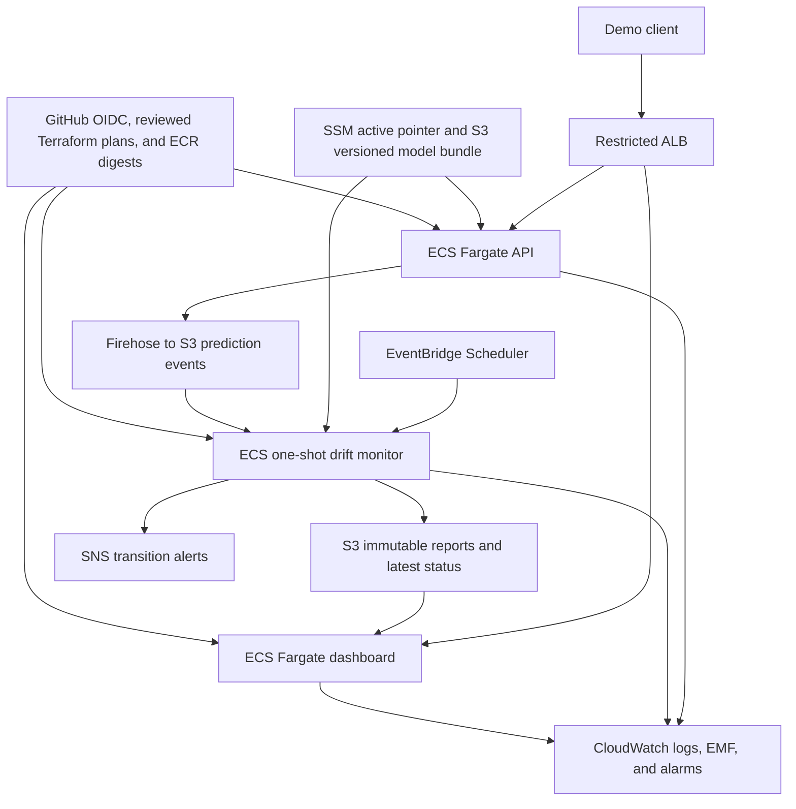

# ModelGuard AI

I built ModelGuard AI to prevent two quiet MLOps failures: serving an incomplete or unverified
model bundle, and treating distribution drift as proof that model accuracy changed. The result is a
synthetic fraud-risk demo that versions model identity end to end, records prediction events,
detects drift in finalized windows, and exposes evidence without overstating what unlabeled data can
prove.

> **Evidence boundary:** all transaction data is synthetic. The AWS environment was a temporary,
> restricted demo and has been destroyed; the separately retained budget and audit/bootstrap
> controls are documented in [the Phase 10 report](reports/phase-10.md). This is a compact
> production-style portfolio project, not a claim of production readiness or high availability.

**Current verification:** the release candidate is reviewed through
[PR #17](https://github.com/sikene3/modelguard-ai/pull/17). The launch-remediation candidate passed
628 local tests at 83.75% branch coverage, strict lint/type checks, the hashed dependency audit,
model verification, and portfolio/manifest validation. The PR is the authoritative status for the
remote Terraform, repository, and container-security gates. See the
[Phase 12 audit](reports/phase-12-final-audit.md) for the remaining accepted MVP boundaries.

## Demo

[](portfolio/assets/demo/modelguard-demo.mp4)

[Watch the full 4 minute 15 second local demonstration](portfolio/assets/demo/modelguard-demo.mp4).
The GIF is derived from that same 1280×720 recording. The full recording is intentionally silent;
use the timed [demo script](portfolio/demo-script.md) as its narration/caption track. Both show the
real loopback application using
synthetic data: verified startup and prediction, a healthy monitoring window, the deterministic
drift trigger, the live degraded dashboard, and the resulting immutable evidence.

The tracked images below are genuine report-backed evidence from the repeatable Phase 11 local demo;
they are explicitly labeled as offline snapshots rather than live-browser captures.

| Healthy finalized window | Injected distribution drift |
| --- | --- |
| [](reports/evidence/phase-11/healthy-dashboard-evidence.png) | [](reports/evidence/phase-11/degraded-dashboard-evidence.png) |

The same fixed anchor produced 1,000 accepted target events in each window. The baseline window was
`healthy`; the shifted window was `degraded`; label-backed performance stayed `unknown` because no
labels were configured. Exact report IDs and hashes are in the
[Phase 11 evidence index](reports/evidence/phase-11/README.md).

## Architecture



The editable diagram is [portfolio/architecture.mmd](portfolio/architecture.mmd). Ready-to-share
[SVG](portfolio/assets/modelguard-architecture.svg) and
[PNG](portfolio/assets/modelguard-architecture.png) exports are generated from that source; see the
[export instructions](portfolio/architecture-export.md).

Locally, the same application boundaries use an immutable bundle on disk, atomic JSONL event files,
JSON/HTML reports, and the Streamlit dashboard. AWS swaps those adapters for SSM, S3, Firehose,
EventBridge Scheduler, SNS, and CloudWatch. The deeper contracts are in
[ARCHITECTURE.md](ARCHITECTURE.md).

## What the demo proves

- A deterministic training workflow persists the split before fitting, calibrates on training data,
  locks the decision threshold on validation data, and evaluates the synthetic test split once per
  training invocation after that lock.
- A seven-file model bundle binds the model, schema, threshold, metrics, baseline, manifest, and
  checksums. Readiness fails closed if verification or trusted loading fails.
- FastAPI returns a bounded, schema-validated prediction with request ID, risk score, decision,
  model version, and latency. Local Prometheus metrics cover requests, latency, predictions, and
  event-sink failures.
- Prediction events retain model, manifest, input-schema, and event-schema identity. The monitor
  freezes a UTC half-open window, deduplicates IDs, and reconciles every raw record.
- Drift, data quality, monitor-run health, and label-backed performance remain separate states.
  Without adequate labels the system does not claim an accuracy or business-performance change.
- The temporary AWS demo used private ECS tasks, restricted ALB ingress, immutable image digests,
  GitHub OIDC, staged Terraform activation, CloudWatch/EMF evidence, and guarded teardown.

Each material public statement is mapped to a command, test, report, or tracked artifact in the
[claims ledger](portfolio/claims-ledger.md). The
[skills-to-evidence table](portfolio/skills-to-evidence.md) maps AWS, MLOps, DevOps, Data
Engineering, security, and observability capabilities to repository evidence.

## Clean local quickstart

Prerequisites are Git, Make, Python 3.12, and `uv` 0.12.x. No AWS credentials or network calls are
needed after the locked Python environment is available. From a clean clone:

```bash
make setup
make train
make verify-model
```

That creates ignored synthetic data, one local MLflow run, training cards/plots, and the immutable
`artifacts/model-bundles/1.0.0/` bundle. Training intentionally refuses to overwrite an existing
data directory or model version.

Generate one stationary window and one shifted window, then run the real monitor at explicit
finalization times:

```bash
uv run python scripts/generate_monitoring_fixture.py \
  --scenario baseline --window-end 2026-01-01T01:00:00Z
uv run python -m modelguard.monitoring.cli run \
  --window-end 2026-01-01T01:00:00Z --as-of 2026-01-01T01:10:00Z

uv run python scripts/generate_monitoring_fixture.py \
  --scenario drifted --window-end 2026-01-01T02:00:00Z
uv run python -m modelguard.monitoring.cli run \
  --window-end 2026-01-01T02:00:00Z --as-of 2026-01-01T02:10:00Z
```

Start the read-only dashboard:

```bash
make dashboard
```

Open `http://127.0.0.1:8501`. The latest report should show `run=succeeded`,
`data_quality=valid`, `drift=degraded`, and `performance=unknown`.

To exercise inference, start the API in another terminal and send the committed synthetic request:

```bash
make api
```

```bash
curl --fail-with-body \
  -H 'Content-Type: application/json' \
  --data @examples/prediction-request.json \
  http://127.0.0.1:8000/v1/predict
```

For the containerized healthy-to-drifted and failure scenarios, follow
[docs/CONTAINER_LOCAL_DEMO.md](docs/CONTAINER_LOCAL_DEMO.md). The narrated 3–5 minute path is
[portfolio/demo-script.md](portfolio/demo-script.md).

## AWS implementation overview

The disposable demo root in [infrastructure/environments/demo](infrastructure/environments/demo)
defines a single-Region ECS Fargate deployment across two Availability Zones. Desired service count
is one and the design intentionally uses one NAT Gateway, so it is not highly available. Key
boundaries are:

1. Bootstrap owns remote state, GitHub OIDC roles, and the workload permission boundary.
2. A reviewed prerequisite plan creates resources with runtimes disabled.
3. Each API/dashboard/monitor image is built and scanned once, then referenced by ECR digest.
4. The seven-file model bundle is published create-only; SSM promotion changes a pointer, not model
   bytes.
5. A second reviewed plan activates services and the monitor schedule only after identity checks.
6. Smoke, report, alarm-source, and inventory evidence is captured before guarded destroy.

The AWS deployment ran during Phase 10 and the disposable environment was then destroyed. This
repository does not expose a live endpoint. See [docs/TERRAFORM_AWS.md](docs/TERRAFORM_AWS.md) and
[reports/phase-10.md](reports/phase-10.md) for the operational and historical evidence boundaries.

## Evidence

| Outcome | Concrete evidence |
| --- | --- |
| Deterministic synthetic training and held-out evaluation | [Phase 02 report](reports/phase-02.md), [training integration test](tests/integration/test_training_workflow_phase02.py) |
| Strict API/readiness and event contracts | [Phase 03 report](reports/phase-03.md), [API contract tests](tests/contract/test_api_contract_phase03.py), [event contract tests](tests/contract/test_prediction_event_contract_phase04.py) |
| Healthy → degraded detection without a performance claim | [Phase 11 evidence index](reports/evidence/phase-11/README.md), [monitor integration tests](tests/integration/test_monitoring_phase05.py) |
| Non-root local containers and fail-open sink scenario | [Phase 07 report](reports/phase-07.md), [container contract tests](tests/unit/test_phase07_local_containers.py) |
| Terraform, IAM, alarms, and guarded lifecycle | [Phase 08 report](reports/phase-08.md), [Terraform contract tests](tests/unit/test_phase08_terraform.py) |
| Reproducible DevSecOps gates | [Phase 09.1 report](reports/phase-09-1.md), [release-gate tests](tests/unit/test_phase091_release_gates.py) |
| Historical live AWS activation and zero disposable residuals after teardown | [Phase 10 report](reports/phase-10.md), [recorded phase status](tasks/phase_status.json) |
| Repeatable failure demo and local cleanup | [Phase 11 report](reports/phase-11.md), [demo tests](tests/unit/test_phase11_demo.py) |

Generated datasets, model binaries, MLflow state, reports, raw cloud receipts, scanner caches, plans,
and Terraform state are intentionally not committed. Tracked evidence is bounded and sanitized.

## Security

- No long-lived AWS access keys are required or accepted by the deployment design; GitHub uses
  bounded OIDC subjects and human operations use browser-authenticated AWS sessions.
- AWS prediction access is always CIDR-restricted. The preferred mode adds ACM HTTPS and a bearer
  value sourced from a pre-created SSM SecureString; the temporary HTTP fallback carries no reusable
  token and makes no authentication or secure-transport claim.
- ECS tasks have no public IP. Containers use numeric UID/GID `10001:10001`, read-only root
  filesystems in Compose, dropped Linux capabilities, and digest-pinned base/deployment images.
- Ruff, Mypy, Pytest, Bandit, hashed `pip-audit`, actionlint, ShellCheck, Checkov, Gitleaks, and Trivy
  form the local/CI quality and security gates. Scanner output is sanitized before eligible upload.
- Logs omit request bodies, feature values, authorization values, environment dumps, and raw
  credentials. Metrics use bounded dimensions.

See [docs/03_SECURITY_BASELINE.md](docs/03_SECURITY_BASELINE.md) for the complete security contract.

## Cost and teardown

The AWS target is a short-lived demonstration, not permanent hosting. The manual
`modelguard-ai-demo-monthly` budget is USD 10 with actual/forecast alerts, but an AWS Budget is a
warning mechanism—not a hard spending cap. The main demo cost drivers are the NAT Gateway, ALB, ECS
tasks, logs, and retained data. Separately retained CloudTrail/KMS/S3 audit controls can continue to
incur cost after the disposable environment is removed.

Teardown is a reviewed, saved-plan workflow with identity, expiry, exact-change, and post-destroy
inventory checks; it is not a casual `terraform destroy` copy-paste command. Use the guarded runbook
in [docs/TERRAFORM_AWS.md](docs/TERRAFORM_AWS.md). The completed Phase 10 teardown recorded zero
disposable demo resources while intentionally retaining the budget and audit/bootstrap control
plane.

## Trade-offs and limitations

- **Synthetic data only.** Scores, thresholds, costs, and drift thresholds do not establish
  real-world fraud performance or business value.
- **No label-backed AWS performance loop.** Local delayed labels are optional; without adequate
  labels, performance is `unknown`. Distribution drift is not an accuracy claim.
- **Deliberately small availability envelope.** One desired task per service and one NAT Gateway
  control cost but do not provide high availability, zero downtime, or multi-Region recovery.
- **No automatic retraining or promotion.** Detection produces evidence for human review; model
  promotion and rollback are separate guarded actions.
- **Restricted demo access, not an authentication platform.** There is no public anonymous service
  or full user/tenant identity system.
- **Batch windows, not real-time monitoring.** Firehose delivery and scheduled finalized windows
  favor bounded evidence over per-event drift decisions.
- **Joblib trust boundary.** Checksums detect byte changes but do not authenticate pickle origin;
  trusted-origin confirmation remains required before deserialization.

The fuller narrative is in [docs/CASE_STUDY.md](docs/CASE_STUDY.md). Portfolio-ready copy and media
instructions live under [portfolio/](portfolio/).
