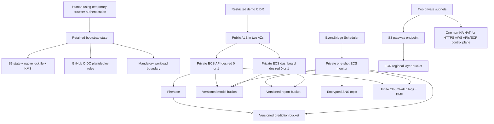

# Phase 08 AWS Terraform architecture

## Status and scope

Phase 08 defines and statically validates infrastructure only. It does not call AWS, create a plan
against an account, or apply/destroy anything. Phase 10 is the first phase allowed to use short-lived
AWS credentials and reviewed saved plans.

The design is a temporary, synthetic portfolio environment. It is not highly available and neither
access mode is presented as an enterprise authentication platform.

## Architecture



The ALB spans two public subnets. API, dashboard, and scheduled monitor tasks span two private
subnets, have no public IP, and accept task ingress only from the ALB security group on ports 8000
and 8501. The monitor has no inbound rule. S3 routes use a gateway endpoint restricted to the exact
demo buckets plus the Region's ECR layer bucket. ECR/API control-plane HTTPS and other AWS APIs use
one NAT gateway; image layer objects follow the more-specific S3 gateway route. DNS stays inside the
VPC. No interface endpoints or second NAT are present.

## Resource inventory

| Area | Resources | Lifecycle/guard |
|---|---|---|
| Bootstrap state | KMS key/alias, S3 bucket, versioning, encryption, public block, TLS-only policy, lifecycle | Retained; `prevent_destroy`; S3 `use_lockfile=true`; separate final cleanup |
| Bootstrap trust | GitHub OIDC provider, CI plan/deploy roles, workload boundary, retained state/SNS key, four scoped CI managed policies and attachments | Retained with `prevent_destroy`; exact OIDC audience/subjects; demo role cannot mutate them |
| Network | VPC, IGW, two public and two private subnets, route tables, one EIP/NAT, S3 gateway endpoint, four security groups | Disposable; one NAT is an explicit non-HA cost choice |
| Images/data | Three immutable ECR repositories; model, prediction, report, and audit S3 buckets | Disposable; force-delete; version and object expiry; no public access |
| Ingestion | Firehose delivery stream and finite log group/stream | GZIP newline JSON; exact `.jsonl.gz` suffix; physical UTC year/month/day/hour prefixes |
| Runtime | ECS cluster, API/dashboard task definitions and services, monitor task definition | Desired counts default zero; schedule default disabled; digest-form images, non-root users, read-only roots, task-scoped writable `/tmp` scratch plus image-owned `/runtime` model volumes |
| Routing | ALB, listeners, two target groups, rules and health checks | Restricted CIDR; `/metrics` fixed 404; circuit-breaker rollback on both services |
| Identity | Execution, API, dashboard, monitor, Firehose, Scheduler roles and inline policies | Exact project path/names; mandatory bootstrap boundary; separate responsibilities |
| Model identity | Active and previous SSM String pointers | Explicit unset sentinel; `ignore_changes` gives later values to promotion |
| Secret reference | ARN of a pre-created SSM SecureString | Terraform never reads the value; ECS `secrets.valueFrom` injects it only into API |
| Operations | Scheduler/group, SNS topic/policy, logs, native/EMF alarms | Finite retention; alarm actions disabled before activation; drift/alarm endpoint enrolled out of band |
| Account prerequisites | Manual USD 10 monthly budget; separate exact-state-object CloudTrail audit root | Retained outside demo state and teardown; endpoints never enter project data |

Every taggable demo resource receives `Project`, `Environment`, `Owner`, `ManagedBy`, `Ownership`,
and `AutoDestroyDate`. The date is a plan guard and reminder, never an automatic deletion mechanism.

## Ownership boundary

| Owner | Owns | Must not own/change |
|---|---|---|
| Human bootstrap | State bucket/KMS, native state locking permissions, OIDC provider, CI roles, mandatory boundary | Disposable workload resources |
| Disposable demo state | VPC through alerts, including the six boundary-constrained workload roles | State/trust bucket, KMS, OIDC, CI roles, permission boundary, manual budget, retained audit resources |
| Model promotion | Active/previous pointer values and controlled ECS rollout decision | Pointer locations, IAM, token value |
| Human secret operator | Pre-created SecureString and its confirmation/rotation | Terraform state or inputs containing token bytes |
| Human notification operator | Console-only budget endpoint plus one separate confirmed drift/alarm SNS subscriber | Terraform variables, plans, state, workflow inputs, artifacts, reports, logs, commands, or examples containing an address |
| ACM owner | Pre-created certificate used by preferred HTTPS mode | Demo state unless a later phase explicitly changes ownership |

The initial pointer is `modelguard.unset.v1` with `UNSET` identity fields. A promoted active pointer
must validate as `modelguard.active-monitor-target.v1`, contain an exact semantic model version and
64-hex manifest digest, target `model-bundles/<version>/`, and pin all seven bundle objects by S3
VersionId. Terraform reads that non-secret pointer only in the activation plan. It never reads the
SecureString.

## Access modes and routing

`https_token` is preferred. It requires a pre-created ACM certificate and an SSM SecureString ARN
under `/modelguard-ai/demo/secrets/`. Port 80 redirects to 443. `POST /v1/predict` receives the token
through ECS `secrets`, and the application verifies HTTPS forwarding plus a constant-time bearer
comparison. The ARN is not marked as a secret because it is metadata; the bytes are never a
Terraform variable, local, data source, plan value, output, test fixture, or evidence field.

The Phase 08 boundary supports the AWS-managed SSM key only (`alias/aws/ssm`). Before activation,
`DescribeParameters` must prove the exact ARN is `SecureString` with that `KeyId`; do not call
`GetParameter`. A customer-managed token key would require a separately reviewed exact-key boundary
change and is not silently accepted. The ARN is also passed as non-secret application identity
metadata, while only ECS `secrets.valueFrom` supplies the token bytes.

`http_cidr_only` is a temporary fallback for synthetic data. It accepts no token or certificate
input and the application rejects authorization headers, so no reusable credential traverses HTTP.
It supplies restricted network exposure, not secure transport or authentication.

Both modes require a canonical restricted IPv4 CIDR. `0.0.0.0/0`, `::/0`, IPv6 (not enabled in this
VPC), malformed CIDRs, and host bits in a network CIDR are refused. Health routes are routed without
token enforcement. `/metrics` and `/metrics/*` are answered by a fixed 404 ALB rule and never reach
the API. All other default traffic goes to the read-only dashboard.

## IAM permission table

| Principal | Allowed boundary | Explicitly absent |
|---|---|---|
| CI plan (bootstrap) | Exact state read/lock object + KMS; one retained scoped read managed policy for refresh/inventory | State write, service mutation, IAM mutation, PassRole |
| CI deploy (bootstrap) | Exact state write/lock; separate compute/data/operations managed policies; exact inline workload-IAM/PassRole policy | OIDC/boundary/CI-role mutation, managed-policy creation, unrestricted IAM |
| ECS execution | ECR auth plus exact repository pulls; exact log streams; configured token ARN only | S3 application data, Firehose, SNS, arbitrary SSM |
| API task | Model bundle reads, exact model pointers, exact Firehose stream writes | Report writes, SNS, IAM |
| Dashboard task | Exact manifest objects and `monitoring/` report-prefix reads/presigned downloads | Any write, pointer/token access, Firehose, SNS |
| Monitor task | Exact model/prediction/report prefixes, pointer reads, exact SNS publish plus AWS-managed SNS-key use | ECR control, IAM, unrelated buckets |
| Firehose | Prediction bucket delivery prefixes and exact Firehose log stream | Model/report buckets, SNS, IAM |
| Scheduler | Exact monitor task revision on exact cluster; PassRole for execution+monitor to ECS only | API/dashboard tasks, other clusters/services/roles |

The CI deploy role has three separate `iam:PassRole` statements: ECS roles only to
`ecs-tasks.amazonaws.com`, Firehose only to `firehose.amazonaws.com`, and Scheduler only to
`scheduler.amazonaws.com`. The Scheduler workload role has its own exact execution/monitor
PassRole statement to ECS. All six demo roles use the bootstrap boundary. The deploy role can create
only those six names with the exact boundary and required project/environment request tags.

Resource `"*"` remains only where AWS offers no useful resource-level ARN, notably ECR authorization,
account/list discovery, legacy Billing authorization, generated EC2/association lifecycle calls, and
tagged ECS cluster creation. Actions are individually enumerated; there is no `Action: "*"`. Billing
view data is narrowed to the exact account's billing-view ARN pattern. Exact account/Region provider
guards, hard lifecycle preconditions, saved-plan identity, exact OIDC subjects, name allowlists,
project tags, and the workload boundary compensate for the remaining AWS API limitations.

The demo deploy role cannot remove or alter the boundary, OIDC provider, CI roles, or retained
managed policies. The bootstrap KMS key policy delegates its enumerated state-key actions through
account IAM; it does not name not-yet-created CI role principals and does not grant `kms:*`.

## OIDC subjects

Both roles require `aud=sts.amazonaws.com` and a `StringEquals` subject built from the repository-
level custom claim order `repo`, `ref`, `environment`, `workflow_ref`. For an immutable repository,
the subject begins `repo:<owner>@<owner-id>/<repository>@<repository-id>`; an explicitly legacy
repository begins `repo:<owner>/<repository>`. The remainder always binds `refs/heads/main`, one
exact protected environment, and one exact workflow path at that same ref.

The plan role accepts only `terraform-plan.yml` in `demo-plan`. The deploy role accepts exact
`deploy-demo.yml`, direct `publish-images.yml`, and `rollback-demo.yml` subjects in `demo`, plus
`destroy-demo.yml` in `demo-destroy`. There is no wildcard repository, ref, environment, or
workflow condition. See `docs/CICD_SECURITY.md` and `.github/oidc-subject-template.json` for the exact
subjects, legacy/immutable inputs, and repository setting.

The plan role's state-bucket listing permission accepts only the exact state key, its lock key, and
Terraform's literal `env:/` workspace-discovery prefix. Terraform performs that bounded discovery
even though every guarded command separately requires the `default` workspace; no wildcard bucket
prefix is granted.

Create the matching IAM conditions first through the browser-authenticated human bootstrap. Only after reviewing the
Terraform subject/template outputs may a repository administrator activate the matching GitHub OIDC
customization. Switching GitHub first is forbidden. Phase 09 ensures fork/untrusted PR jobs receive
neither `id-token: write` nor state/AWS credentials.

## Bootstrap and deployment order

### 1. Validate the two roots locally

```bash
terraform fmt -check -recursive infrastructure
terraform -chdir=infrastructure/bootstrap init -backend=false -input=false -lockfile=readonly
terraform -chdir=infrastructure/bootstrap validate
terraform -chdir=infrastructure/environments/demo init -backend=false -input=false -lockfile=readonly
terraform -chdir=infrastructure/environments/demo validate
make security-tools-bootstrap
make security-scan
```

The shared Checkov invocation uses the exact locked OCI digest and covers Terraform, Dockerfiles,
and GitHub Actions. It must not be replaced with an unpinned global `checkov` command.

Initialization generates one reviewed `.terraform.lock.hcl` in each root. Both lock files pin the
same signed hashicorp/aws version and checksum set; commit them, but never commit `.terraform/`
working directories.

### 2. Human bootstrap in Phase 10

Copy `infrastructure/bootstrap/bootstrap.auto.tfvars.example` to a Git-ignored file. Supply the exact
repository names, numeric owner/repository IDs, immutable-subject flag, ref, environments, and
workflow paths. First run the locked local `scripts.human_aws_login dependency` check; it proves
`awscrt==0.36.0` satisfies Botocore without an AWS call. After separate approval, a human runs
`aws login --profile modelguard-bootstrap`, uses only that explicit profile, runs
`python -m scripts.human_aws_login verify` for the exact account and `us-east-1`, and refuses root,
environment, shared-file, or other static credentials. The verified temporary browser identity produces a
saved plan, reviews it, and applies it before activating the GitHub custom subject template. Preserve
bootstrap state in an approved encrypted location. Record only non-secret outputs. Before that
apply, the account/organization owner must confirm an existing CloudTrail trail
captures S3 data events for the exact future state-bucket ARN; that retained account-level control is
why this root does not create a circular second state-log bucket.

The demo backend is rendered together with its guarded stage inputs in the next step. The required
fields are exact bucket/key/Region/KMS, `encrypt=true`, and `use_lockfile=true`; do not maintain a
second copied backend configuration. The guard refuses missing or additional fields, a wrong
account/Region key ARN, or a bucket that does not match the exact account/Region naming contract.

### 3. First reviewed saved plan: prerequisites

Render the noncommitted inputs with `scripts.render_ci_terraform` into an absolute, Git-ignored
operator directory. For this solo run, set `DEPLOYMENT_GOVERNANCE_MODE=solo_portfolio` exactly and
pass it as `--governance-mode "$DEPLOYMENT_GOVERNANCE_MODE"`. There is no implicit governance mode;
`team_protected` is allowed only with a real independent reviewer. The supported human
`TFVARS_FILE` is the renderer's `demo-ci.tfvars.json`, which is strict JSON with exact mode `0600`:

```bash
export DEPLOYMENT_GOVERNANCE_MODE=solo_portfolio
umask 077
uv run --frozen --no-sync python -m scripts.render_ci_terraform \
  --output-dir /absolute/git-ignored/operator-inputs/prerequisites \
  --stage prerequisites \
  --account-id 123456789012 \
  --region us-east-1 \
  --owner-tag portfolio-owner \
  --governance-mode "$DEPLOYMENT_GOVERNANCE_MODE" \
  --auto-destroy-date YYYY-MM-DD \
  --backend-bucket modelguard-ai-terraform-state-123456789012-us-east-1 \
  --backend-kms-key-arn '<bootstrap-state-key-arn>' \
  --permission-boundary-arn '<bootstrap-boundary-arn>' \
  --alert-kms-key-arn '<bootstrap-alert-key-arn>' \
  --alb-allowed-cidr '<restricted-cidr>' \
  --access-mode http_cidr_only
export TFVARS_FILE=/absolute/git-ignored/operator-inputs/prerequisites/demo-ci.tfvars.json
export BACKEND_CONFIG=/absolute/git-ignored/operator-inputs/prerequisites/backend.hcl
```

Use the HTTPS-only renderer arguments instead when `https_token` is selected. Use a current
restricted CIDR and an AutoDestroyDate no more than 14 days away. For HTTPS, include only ACM and
SecureString ARNs. No notification address is a Terraform input. Set `alert_kms_key_arn` only from
the bootstrap `alert_kms_key_arn` output; it is non-secret and is bound to the guarded account and
Region. The human helpers reject HCL tfvars, symlinks, foreign-owned inputs, invalid JSON, and any
permission mode other than `0600`.
The renderer's `backend.hcl` is the canonical `BACKEND_CONFIG`; it is also owner-controlled,
non-symlinked, and mode `0600`. Do not substitute a separately copied or more permissive backend
file after review.

```bash
umask 077
uv run --frozen --no-sync python scripts/terraform_demo_guard.py verify-backend \
  --input "$BACKEND_CONFIG" \
  --bucket modelguard-ai-terraform-state-123456789012-us-east-1 \
  --account-id 123456789012 --region us-east-1
terraform -chdir=infrastructure/environments/demo init \
  -input=false -reconfigure -lockfile=readonly \
  -backend-config="$BACKEND_CONFIG"
if ! terraform -chdir=infrastructure/environments/demo plan -input=false -no-color \
  -var-file="$TFVARS_FILE" -out=prerequisites.tfplan >/dev/null 2>&1; then
  echo "Prerequisite-plan creation failed; raw Terraform output was suppressed." >&2
  exit 1
fi
```

The restrictive umask is mandatory: the opaque saved plan must be an owner-controlled regular file
with mode `0600`, or the seal and evidence guards refuse it.

The first plan must have `deployment_stage=prerequisites`, `activate_services=false`,
`runtime_contract_verified=false`, no image inputs, API/dashboard desired count zero, and schedule
disabled. Task definitions use an explicit non-runnable zero digest so no mutable tag ever appears.
Alarm actions are disabled. The `terraform_data.deployment_guard` lifecycle preconditions make an
invalid identity, date, transport combination, or stage a plan error. Do not use
`terraform -target`.

Bind the opaque saved plan to its plan hash, variable-file hash, backend-file hash, account, Region,
project, environment, backend key, default workspace, Git commit, stage, activation state, and
AutoDestroyDate. The strict identity is `modelguard.saved-plan-identity.v2`, which also binds the
required Owner tag, deployment governance mode, and teardown authorization. Destroy identities also
bind the plan-derived runtime source-state enum; legacy v1 manifests are rejected rather than
inferred or upgraded:

```bash
uv run --frozen --no-sync python scripts/terraform_demo_guard.py seal-plan \
  --plan infrastructure/environments/demo/prerequisites.tfplan \
  --var-file "$TFVARS_FILE" \
  --backend-config "$BACKEND_CONFIG" \
  --stage prerequisites --account-id 123456789012 --region us-east-1 \
  --repository . --auto-destroy-date YYYY-MM-DD --activate-services false \
  --output infrastructure/environments/demo/prerequisites.tfplan.identity.json
```

Render persistent review evidence only after the plan is sealed. This is a separate, create-only
evidence command; `safe_apply.sh` does not populate or overwrite these paths. The raw
human-readable plan and the raw JSON must never be printed or persisted as evidence:

```bash
terraform -chdir=infrastructure/environments/demo show -json prerequisites.tfplan 2>/dev/null \
  | uv run --frozen --no-sync python -m scripts.plan_evidence \
      --plan infrastructure/environments/demo/prerequisites.tfplan \
      --manifest infrastructure/environments/demo/prerequisites.tfplan.identity.json \
      --output-json infrastructure/environments/demo/prerequisites.tfplan.redacted.json \
      --output-markdown infrastructure/environments/demo/prerequisites.tfplan.redacted.md \
      --repository local/operator --run-id human --run-attempt 1 \
      --workflow-ref local/operator
chmod 0600 infrastructure/environments/demo/prerequisites.tfplan.redacted.{json,md}
```

Verification must run immediately before applying the same saved plan in Phase 10. A renamed,
modified, more-than-24-hour-old, implausibly future-dated, wrong-commit, wrong-account, wrong-Region,
wrong-backend, or wrong-stage plan is refused.

If a prerequisite apply stops partway through, its single recovery plan may carry provider-state
normalization records only when every drift address is an exact owned ModelGuard resource and uses
the expected provider and tags. Each drifted resource must have an identical desired state with a
managed `no-op` action in that same plan. The only bounded completion update is `aws_lb.this` after
an interrupted create: the live ALB must still have disabled access logging, invalid-header dropping,
and the provider-default defensive desync mode. The plan changes only those fields to the exact
ModelGuard audit bucket and `alb` prefix, enabled invalid-header dropping, and `strictest` mode. The
same recovery may contain one exact audit-bucket policy correction for ALB log delivery. That
statement retains the service principal, `s3:PutObject` action, account-bearing object prefix, and
exact account and Region in `aws:SourceArn`; it removes the unsupported `aws:SourceAccount`
condition and uses AWS's documented `loadbalancer/*` SourceArn shape. The evidence guard compares
the complete before/after policy and rejects any other statement, principal, action, resource,
account, Region, or condition change. The recovery plan must also contain both existing `no-op`
resources and remaining `create` actions. A partial apply may also expose the original Scheduler
execution-role trust policy, which incorrectly scoped `aws:SourceArn` to an individual schedule.
AWS requires that condition to use the schedule-group ARN. The recovery guard therefore accepts
only the exact transition from the ModelGuard monitor schedule ARN to its exact monitor
schedule-group ARN, while retaining the exact Scheduler service principal, `sts:AssumeRole`,
`aws:SourceAccount`, account, Region, role identity, boundary, tags, and every unrelated role field.
Wildcard groups, schedule-name prefixes, other principals, or any additional role mutation are
refused. Every other configuration-changing drift, unrelated
resource, replacement, deletion, import, deposed instance, activation drift, or drift without an
exact desired-state match remains fail-closed.

An activation maintenance plan may report one provider-only normalization for
`aws_iam_role.scheduler`: the AWS provider can serialize the existing inline-policy JSON in a
different key order and advance its computed copy from the prior monitor task-definition revision
to the already-applied current revision. The review guard accepts that record only when it is the
sole drift entry; both the managed Scheduler role and separately managed Scheduler policy are exact
no-ops at the refreshed state; every non-policy field and required ownership tag is unchanged; and
strict parsing proves both policies retain the exact cluster, execution/monitor roles, conditions,
actions, and task-definition family in the bound account and Region. Any other changed statement,
principal, action, resource, condition, role field, additional drift entry, or non-no-op desired
action remains refused. The redacted evidence records only the address, provider, resource type,
and normalization attestation.

The same activation maintenance boundary supports one exact restricted-client CIDR rotation. Both
the previous and replacement values must be canonical IPv4 `/32` networks; the ALB HTTP ingress
rule may change only `cidr_ipv4`; and the API task-definition replacement must change only the
matching `ALB_ALLOWED_CIDR` environment value apart from provider-empty optional collections. The
API service must update to that exact replacement task. Any world CIDR, additional ingress field,
unrelated container change, mismatched runtime CIDR, or broader resource action is refused. Review
evidence emits only a boolean CIDR-rotation attestation; the values remain confined to the sealed
private inputs and raw plan.

In Phase 10 only, the manual operator path applies this exact file through `scripts/safe_apply.sh`.
The script rechecks backend/account/Region/default workspace, renders and displays only the sealed
action-only redacted evidence from a newly created mode-`0700` temporary directory, verifies the
sealed identity, requires the operator to type the exact stage, and verifies identity again
immediately before `terraform apply <saved-plan>`. Both temporary evidence files are mode `0600`;
the helper prints only the Markdown and removes the directory on success, cancellation, or failure.
Persistent redacted evidence may already exist and is never reused or modified. Activation also
re-reads the non-secret SSM active pointer into that same temporary directory with the explicit
profile and Region and `--no-with-decryption`, then calls `verify-active-pointer` after the
confirmation and final plan check. Prerequisites skip that pointer read. One EXIT cleanup handles
both the evidence and pointer without replacing an earlier trap. The helper suppresses raw Terraform
apply diagnostics, never creates a plan, and accepts no arbitrary plan name:

```bash
CONFIRM_APPLY=YES \
EXPECTED_AWS_ACCOUNT_ID=123456789012 \
AWS_REGION=us-east-1 \
AWS_PROFILE=modelguard-bootstrap \
BACKEND_BUCKET_NAME=modelguard-ai-terraform-state-123456789012-us-east-1 \
BACKEND_CONFIG="$BACKEND_CONFIG" \
TFVARS_FILE=/absolute/git-ignored/operator-inputs/prerequisites/demo-ci.tfvars.json \
DEPLOYMENT_GOVERNANCE_MODE=solo_portfolio \
PLAN_STAGE=prerequisites \
scripts/safe_apply.sh
```

### 4. Verify retained budget, enroll drift notifications, then publish prerequisites

Before any demo apply, a human manually creates the retained `modelguard-ai-demo-monthly` budget in
the AWS Console at USD 10 with 50/80/100 percent actual and 100 percent forecast alerts. The endpoint
is entered only in the Console. `scripts.aws_readiness_preflight budget` checks the exact value-free
identity and threshold set without requesting subscriber endpoints. The budget is outside Terraform,
state, saved plans, workflow data, and demo teardown; alerts do not cap spending.

After prerequisite apply, a human using temporary browser credentials runs
`scripts.notification_enrollment enroll` for the separate drift/alarm SNS topic. The prompt accepts
one endpoint without echo, writes no files, and emits no address. The protected deployment calls the
value-free verifier and refuses before image publication unless exactly one confirmed subscription
exists. This is not the budget enrollment path.

Build each role image once for the reviewed Git SHA, scan that exact image, push one immutable
`git-<sha>` tag, and resolve it with ECR `DescribeImages`. Activation uses only
`repository@sha256:<digest>`; it never rebuilds or deploys a tag.

Run only `python -m scripts.model_bundle_publisher publish-and-promote` with the exact confirmation
documented in `08_AWS_DEPLOYMENT_ORDER.md`. It rejects all historical use of the semantic-version
prefix, conditionally creates the verified seven-file bundle, reads every exact VersionId back, and
promotes active/previous under an owner-verified conditional S3 lock. Pointer writes are
previous-first and active-last; a failed promotion restores both snapshots, while an unprovable
rollback retains the lock and blocks all retry. Partial model objects are never deleted or reused.
Verify the pointer and bundle independently. In HTTPS mode, use SSM `DescribeParameters` to prove the
ARN names a `SecureString` using `alias/aws/ssm` without calling `GetParameter`; verify the ACM
certificate is issued and covers the ALB hostname, and verify all ECR digests. Confirm the value-free
budget and drift-notification gates. Run image contract tests proving API SSM/S3 hydration, exact
dashboard AWS evidence-source health, and the monitor's one-shot `aws-run` contract.

`scripts/verify_release_runtime.sh` now exercises those implemented contracts in each actual image
and emits a source/image/`uv.lock`-bound v2 record through a mode-0600 atomic write. The committed
`runtime_contract_verified` default remains
false. Activation rendering can make it true only when a digest-mode record exactly matches all
three activation image references; local image-ID evidence cannot activate Terraform. Live ECS/IAM
behavior remains a Phase 10 smoke gate.

### 5. Second reviewed saved plan: activation

Set `deployment_stage=activation`, `activate_services=true`, all three exact digest references,
`runtime_contract_verified=true`, and the verified pointer's model version, manifest SHA-256, and
seven-entry S3 VersionId map. The activation plan freshly reads the non-secret active pointer and
requires exact equality with those inputs before setting desired count one, enabling alarm actions,
and enabling the schedule.

```bash
if ! terraform -chdir=infrastructure/environments/demo plan -input=false -no-color \
  -var-file="$TFVARS_FILE" -out=activation.tfplan >/dev/null 2>&1; then
  echo "Activation-plan creation failed; raw Terraform output was suppressed." >&2
  exit 1
fi
```

Seal the identity beside the activation plan, then use the same guarded script with
`PLAN_STAGE=activation`; review, verify, and only then apply it in Phase 10. No ad hoc target,
refresh-only substitute, mutable tag, or rebuilt image may bridge the two stages.

## Alarm source matrix

The machine-readable source inventory is `infrastructure/alarm-sources.json` and a static test proves
each entry exists in Terraform and, for EMF, in application source.

| Signal | Namespace/metric | Producer | Missing-data policy |
|---|---|---|---|
| API target 5xx | `AWS/ApplicationELB/HTTPCode_Target_5XX_Count` | ALB | not breaching |
| API p95 latency | `AWS/ApplicationELB/TargetResponseTime` | ALB | not breaching |
| API/dashboard healthy hosts | `AWS/ApplicationELB/HealthyHostCount` | ALB | breaching after activation |
| S3 delivery | `AWS/Firehose/DeliveryToS3.Success` | Firehose | not breaching when idle |
| Schedule submission failure | `AWS/Scheduler/TargetErrorCount` | Scheduler | not breaching when idle |
| API event write failure | `ModelGuardAI/EventSinkErrors` | API EMF | not breaching; sparse failure metric |
| Monitor completion | `ModelGuardAI/MonitorCompletions` | One monitor EMF record/run | breaching |
| Monitor input | `ModelGuardAI/RawRecords` | Same EMF record | breaching |
| Monitor rejected | `ModelGuardAI/RejectedRecords` | Same EMF record | breaching |
| Monitor predictions | `ModelGuardAI/AcceptedTargetRecords` | Same EMF record | breaching |
| Report freshness | `ModelGuardAI/ReportFreshnessSeconds` | Same EMF record | breaching |

Scheduler target submission is not monitor completion. A monitor failure emits no successful
heartbeat, so the completion and companion metrics become missing and breach. API event-write
failures are sparse and missing is healthy. No alarm uses ECS desired/running metrics because paid
Container Insights is explicitly disabled.

`AcceptedEventFreshnessSeconds` remains telemetry for accepted event-time freshness and explicitly
does not claim row delivery lateness. `ReportFreshnessSeconds` is `monitor as_of - finalized window
end` and is the source for the report-age alarm.

## Cost controls and known assumptions

Primary cost drivers are the NAT gateway, ALB, two one-task Fargate services while active, one-shot
monitor runs, Firehose ingestion, log storage, S3 objects, and the retained state KMS key. ECR and S3
lifecycle rules bound stale images, current objects, noncurrent versions, and incomplete multipart
uploads. Logs retain 14 days by default. Desired count one and one NAT are non-HA choices.

The retained monthly budget is manually created in the AWS Console with the exact USD 10 and four
threshold contract. Its endpoint never enters Terraform or project-controlled data, and the demo
deploy role has no budget mutation permissions. The disposable encrypted SNS topic is for
drift/CloudWatch alerts. Existing exact Budget and CloudWatch service-principal statements in the
retained key policy remain independently constrained by source account, source ARN, topic encryption
context, and `kms:ViaService = sns.<region>.amazonaws.com`; they provide no wildcard authority and do
not make the manual budget Terraform-owned. Billing data and notifications can be delayed, so
neither path is a hard real-time spending cap.

Assumptions:

- Commercial AWS partition, Python 3.12 images, Fargate platform 1.4.0, and one Region (default
  `us-east-1`).
- The selected Region has exactly the two configured AZs, supports Scheduler, Firehose extended S3,
  Fargate, ALB, ACM, ECR, SSM, SNS, and the separate retained CloudTrail design.
- Account service-linked roles needed by these managed services already exist or are created once by
  an authorized human; the demo deploy role cannot create arbitrary IAM service-linked roles.
- Required HTTPS AWS API and ECR control-plane egress uses the single NAT. ECR layer objects and demo
  S3 data use the S3 gateway endpoint. No interface endpoints or second NAT are added.
- The pre-created prediction token uses the AWS-managed SSM key. The drift/alarm SNS topic uses the retained
  bootstrap customer-managed key with exact source account, source ARN, topic context, and regional
  SNS ViaService conditions in each Budget/CloudWatch key-policy statement, so both services can
  publish without creating a second retained key.
- CloudWatch alarms publishing to the encrypted SNS topic, Scheduler dimensions, Firehose
  delivery, and every digest-pinned image contract require live Phase 10 smoke evidence before
  activation is accepted as operationally complete.
- S3 demo data uses SSE-S3 so destroy leaves no demo KMS key pending deletion. Data is synthetic,
  buckets are TLS-only/private, and the retained state bucket does use a dedicated rotating KMS key.
- Cross-Region S3 replication, a WAF, paid VPC Flow Logs, and KMS encryption for short-lived logs/data
  are narrowly skipped security checks because of the temporary restricted synthetic scope. ALB/S3
  access logs, native telemetry, versioning, lifecycle cleanup, and restricted ingress compensate.

There are 54 line-local directives. Expansion of `for_each` resources produces exactly 63 skipped
Checkov result instances; the counts below sum to 63. Every directive is inside the exact affected
resource or data block. There is no global Checkov configuration, command-line check suppression,
wildcard check ID, or repository-wide exception.

| Check (result instances) | Exact scope | Justification/compensating control |
|---|---|---|
| `CKV_AWS_109` (2) | Bootstrap and retained-audit KMS documents | Same-account root is the exact retained recovery/IAM-delegation principal; each service path is separately constrained |
| `CKV_AWS_111` (3) | Both KMS documents; `data.aws_iam_policy_document.ci_deploy_compute` | KMS policies must denote their own key; generated EC2/association IDs cannot be known before creation, while principals, actions, and guards remain fixed |
| `CKV_AWS_356` (3) | Both KMS documents; `ci_deploy_compute` | Same unavoidable resource forms; no `Action: "*"`, service use has exact source/context conditions, and resource-addressable workload actions use exact ARNs |
| `CKV_AWS_18` (3) | State, data-plane, and retained-audit buckets | Retained state has exact CloudTrail data events; evidence sinks cannot recursively server-log to themselves |
| `CKV_AWS_144` (3) | State, data-plane, and retained-audit buckets | Approved single-Region scope; versioning, encryption, preserved state, and finite retention remain |
| `CKV2_AWS_62` (3) | State, data-plane, and retained-audit buckets | No unconsumed S3 notification path is part of the exact state, Firehose, monitor, or audit contract |
| `CKV_AWS_252` (1) | Retained exact-state-object CloudTrail | An unconsumed retained SNS path would add authority/cost and invite endpoint PII; S3 evidence is authoritative |
| `CKV_AWS_67` (1) | Retained exact-state-object CloudTrail | Only two exact `us-east-1` state objects are in scope; an all-Region trail would broaden collection |
| `CKV2_AWS_10` (1) | Retained exact-state-object CloudTrail | A duplicate CloudWatch Logs path adds retained IAM, ingestion, storage, and cost without serving recovery |
| `CKV_AWS_145` (1) | `module.data_plane.aws_s3_bucket.this` | Private synthetic data uses SSE-S3 to avoid a demo KMS key lingering after teardown; TLS, public block, versioning, and lifecycle remain |
| `CKV_AWS_136` (3) | API, dashboard, and monitor ECR repositories | Private immutable scan-on-push repositories contain no secrets; AES256 avoids a lingering disposable key |
| `CKV_AWS_158` (4) | API, dashboard, monitor, and Firehose log groups | Short-lived synthetic logs use AWS-managed encryption so teardown leaves no customer key pending deletion |
| `CKV_AWS_338` (4) | Same four log groups | Validated finite retention matches the temporary cost/teardown contract; one-year retention does not |
| `CKV_AWS_65` (1) | `aws_ecs_cluster.this` | Paid Container Insights is intentionally disabled; no alarm claims its metrics, and native/EMF sources are statically checked |
| `CKV2_AWS_11` (1) | `module.network.aws_vpc.this` | Paid flow logs are omitted; ALB access logs, application/service telemetry, and restricted rules remain |
| `CKV2_AWS_5` (3) | API, dashboard, and monitor task security groups | Checkov cannot trace the module outputs; static tests bind each group to its ECS service or Scheduler task, and monitor has no ingress |
| `CKV_AWS_382` (3) | API, dashboard, and monitor 443 egress rules | Exact-port AWS/ECR HTTPS egress uses the documented single NAT; S3 uses the exact-resource gateway endpoint |
| `CKV_AWS_150` (1) | `aws_lb.this` | ALB deletion protection conflicts with mandatory guarded teardown and residual verification |
| `CKV2_AWS_20` (1) | `aws_lb.this` | The conditional synthetic-only HTTP mode intentionally forwards; preferred `https_token` mode creates the HTTPS redirect |
| `CKV2_AWS_28` (1) | `aws_lb.this` | WAF is intentionally omitted only for this restricted, disposable synthetic demo |
| `CKV_AWS_378` (2) | API and dashboard target groups | TLS terminates at the ALB; each private hop is security-group restricted to one exact target port |
| `CKV_AWS_2` (1) | Conditional `aws_lb_listener.http_demo` | Preferred mode redirects to HTTPS; fallback carries no reusable token and makes no secure-transport claim |
| `CKV_AWS_103` (1) | Conditional `aws_lb_listener.http_demo` | TLS policy is inapplicable to the disclosed HTTP fallback; the HTTPS listener enforces TLS 1.2 or newer |
| `CKV_AWS_241` (1) | `aws_kinesis_firehose_delivery_stream.predictions` | AWS-owned stream encryption plus encrypted private destination avoids a customer key lingering after teardown |
| `CKV_AWS_297` (1) | `aws_scheduler_schedule.monitor` | The synthetic command contains no secret; AWS-owned encryption avoids a lingering disposable key |
| `CKV2_AWS_34` (2) | Active and previous SSM model pointers | Values are integrity metadata, not credentials; the separate SecureString token is pre-created and never read by Terraform |
| `CKV_AWS_319` (12) | Twelve expanded ALB, Firehose, Scheduler, API EMF, and monitor EMF alarms | Actions are disabled only in prerequisites and enabled by the guarded activation plan; every metric source and missing-data policy is explicit |

There is no EKS, RDS, MSK, interface endpoint fleet, second NAT, always-on monitor, auth platform,
automatic retraining, or automatic deletion service.

## Guarded destroy and retained inventory

Render a fresh private, one-run destroy input set rather than reusing prerequisite or activation
tfvars. The AutoDestroyDate is the exact deployed tag value and must not be moved forward merely
because it has expired:

```bash
umask 077
uv run --frozen --no-sync python -m scripts.render_ci_terraform \
  --output-dir /absolute/git-ignored/operator-inputs/destroy \
  --stage destroy --teardown-authorized \
  --account-id 123456789012 --region us-east-1 \
  --owner-tag '<deployed-owner>' --governance-mode solo_portfolio \
  --auto-destroy-date '<exact-deployed-AutoDestroyDate>' \
  --backend-bucket modelguard-ai-terraform-state-123456789012-us-east-1 \
  --backend-kms-key-arn '<bootstrap-state-key-arn>' \
  --permission-boundary-arn '<bootstrap-boundary-arn>' \
  --alert-kms-key-arn '<bootstrap-alert-key-arn>' \
  --alb-allowed-cidr '<deployed-restricted-cidr>' \
  --access-mode '<deployed-access-mode>'
export TFVARS_FILE=/absolute/git-ignored/operator-inputs/destroy/demo-ci.tfvars.json
export BACKEND_CONFIG=/absolute/git-ignored/operator-inputs/destroy/backend.hcl
export TEARDOWN_AUTHORIZED=true
```

For deployed `https_token`, add the exact deployed ACM certificate and SSM parameter ARNs. The
renderer fixes the Terraform stage to prerequisite form, disables services, removes all runtime and
model identity inputs, and sets the otherwise-false teardown authorization. This file is valid only
for the guarded destroy that seals it.

Run `scripts/safe_destroy.sh` only in Phase 10 with the required explicit account, Region, backend,
renderer-produced mode-`0600` `.tfvars.json`, exact `DEPLOYMENT_GOVERNANCE_MODE`, and date inputs. It
also requires `POST_DESTROY_INVENTORY` to be a new absolute path under an already existing,
operator-owned, non-symlinked, mode-`0700` encrypted evidence directory. For example:

```bash
install -d -m 0700 /absolute/encrypted/phase-10/teardown
export POST_DESTROY_INVENTORY=/absolute/encrypted/phase-10/teardown/post-destroy-inventory-initial.json
```

Run the complete guarded command with the same reviewed renderer output and deployed date:

```bash
CONFIRM_DESTROY=YES \
TEARDOWN_AUTHORIZED=true \
EXPECTED_AWS_ACCOUNT_ID=123456789012 \
AWS_REGION=us-east-1 \
AWS_PROFILE=modelguard-bootstrap \
BACKEND_BUCKET_NAME=modelguard-ai-terraform-state-123456789012-us-east-1 \
BACKEND_CONFIG="$BACKEND_CONFIG" \
TFVARS_FILE="$TFVARS_FILE" \
AUTO_DESTROY_DATE=YYYY-MM-DD \
DEPLOYMENT_GOVERNANCE_MODE=solo_portfolio \
POST_DESTROY_INVENTORY="$POST_DESTROY_INVENTORY" \
scripts/safe_destroy.sh
```

The two interactive phrases are exactly `modelguard-ai` and
`DESTROY SOLO modelguard-ai demo` for this governance mode. Review the value-free destroy evidence
before entering the second phrase.

The helper verifies backend identity before init, confirms STS and configured Region, requires the default
workspace, creates exactly `destroy.tfplan` while suppressing raw plan diagnostics, seals its
identity, displays only action-only redacted evidence, requires two human confirmations, verifies
the unchanged saved plan immediately before a raw-output-suppressed apply, then calls
`scripts/verify_aws_teardown.sh`. The saved-plan identity guard deliberately accepts an expired
AutoDestroyDate for the exact `destroy.tfplan`; it is a teardown deadline, not an authorization to
strand resources. Phase 10 must still review the provider-backed destroy plan before applying it.

The destroy plan, identity manifest, redacted JSON, and redacted Markdown are one persistent,
create-only review set beside the plan. The helper refuses before the plan command when any one of
those targets already exists. A cancellation never overwrites or deletes the sealed set: archive all
four files to approved private storage or deliberately remove those exact files before beginning a
new review. This differs intentionally from `safe_apply.sh`, whose plan/identity already exist and
whose additional interactive review rendering is temporary.

Destroy evidence is accepted only when it contains at least one managed resource and every managed
resource action is exactly `delete`. Managed `no-op`, replacement, create, update, mixed, and empty
destroy plans are refused; data-source `read`/`no-op` entries do not count as teardown. Destroy-only
provider drift is accepted only after exact address, provider, resource type, required
ModelGuard tag, and Owner validation; the review evidence emits only the redacted address/action and
count. Unknown, foreign, untagged, or any non-destroy drift fails closed. The saved
manifest keeps `activate_services=false` for the dormant destroy inputs and separately binds
`source_activation_state` as `active`, `dormant`, or `mixed_or_partial`. The guard derives that enum
from the API and dashboard desired counts plus Scheduler state in the saved destroy plan's private
before-values; it never relies on a potentially absent or stale root output. Plan evidence
independently recomputes the enum. When the deployment guard is present in state, its before-value
must match the sealed governance mode; absence after a partial apply remains recoverable.

Tag inventory is necessary but not sufficient. Record service-specific post-destroy queries for:

- ECS clusters/services/tasks/task definitions;
- ELBv2 load balancers/listeners/rules/target groups;
- EC2 NAT gateways, EIPs, VPC endpoints, VPC/subnets/routes/security groups;
- Firehose streams and Scheduler schedules/groups;
- S3 buckets plus all current/noncurrent/delete-marker versions and incomplete multipart uploads;
- ECR repositories/images;
- CloudWatch log groups/alarms;
- SNS topics/subscriptions, SSM pointer locations, and workload IAM roles. The manual budget and
  retained audit resources are expected retained inventory and are not demo orphans.

The teardown verifier produces the strict `modelguard.post-destroy-inventory.v2` payload. It binds
the evidence to the verified account and Region and keeps three exhaustive sections separate:

- `service_residuals` contains every live-resource query, including active ECS task definitions;
- `retained_resources` must contain exactly the mandatory `modelguard-ai-demo-monthly` Budget; and
- `nonbillable_metadata` may contain only inactive revisions of the exact ModelGuard API,
  dashboard, and monitor task-definition families in the bound account and Region.

The Python guard rejects unknown or missing schema fields/categories, any missing or additional
Budget, malformed/foreign inactive task-definition metadata, and any tagged or service-specific
live residual. Inactive task-definition revisions are immutable, nonbillable ECS registration
metadata; they are recorded as validated evidence rather than misreported as live resources. Retain
the create-only initial JSON in the encrypted directory. After the eventual-consistency delay, run
the verifier directly with the same identity inputs and
`INVENTORY_OUTPUT=/absolute/encrypted/phase-10/teardown/post-destroy-inventory-confirmation.json`.
Both files must remain mode `0600`; an empty first response is not proof by itself, and neither path
may be reused. Any query error fails closed instead of being normalized to an empty result.

After the bounded eventual-consistency wait, create the distinct confirmation receipt directly:

```bash
EXPECTED_AWS_ACCOUNT_ID=123456789012 \
AWS_REGION=us-east-1 \
AWS_PROFILE=modelguard-bootstrap \
INVENTORY_OUTPUT=/absolute/encrypted/phase-10/teardown/post-destroy-inventory-confirmation.json \
scripts/verify_aws_teardown.sh
```

The protected destroy workflow performs the same two-receipt sequence. It uploads both raw receipts
create-only under the encrypted state bucket's dedicated `phase-10-evidence/teardown/` prefix,
requires S3 SHA-256 checksum readback, emits only receipt SHA-256 values publicly, and removes the
runner copies. That prefix has an independent 30-day lifecycle; it is not the one-day confidential
saved-plan transfer area. Closure must retrieve and seal the receipts before that finite retention
expires.

If the reviewed destroy plan was applied successfully but the inventory or receipt-retention step
failed, the workflow remains failed. Do not rerun or apply a zero-delete plan and do not convert the
event into a green workflow. A browser-authenticated human must bind the failed repository,
workflow run/attempt, source commit, reviewed plan and manifest hashes, account, and Region; inspect
the exact retained backend read-only and prove zero managed resources; then run
`scripts/verify_aws_teardown.sh` twice into distinct new create-only private paths. Record both
checksums against the failed workflow's private evidence. Preserve the old confidential transfer
until the provenance and both receipts have been independently reconciled. Any managed state
requires a fresh ordinary nonempty plan in which every managed action is exactly `delete`.

Use the same exact mode-`0600` destroy `BACKEND_CONFIG` and never persist or print raw state:

```bash
uv run --frozen --no-sync python -m scripts.human_aws_login verify \
  --profile modelguard-bootstrap --region us-east-1 \
  --expected-account-id "$EXPECTED_AWS_ACCOUNT_ID" >/dev/null
uv run --frozen --no-sync python scripts/terraform_demo_guard.py verify-backend \
  --input "$BACKEND_CONFIG" --bucket "$BACKEND_BUCKET_NAME" \
  --account-id "$EXPECTED_AWS_ACCOUNT_ID" --region us-east-1 >/dev/null
terraform -chdir=infrastructure/environments/demo init \
  -input=false -reconfigure -lockfile=readonly -backend-config="$BACKEND_CONFIG" >/dev/null
test "$(terraform -chdir=infrastructure/environments/demo workspace show)" = default
terraform -chdir=infrastructure/environments/demo state pull 2>/dev/null | \
  uv run --frozen --no-sync python scripts/terraform_demo_guard.py \
    verify-empty-managed-state >/dev/null
```

Any identity, backend, workspace, state-structure, or nonempty-managed-state failure stops recovery.
Only after this proof may the operator create the two new inventory receipts described above; the
original failed run and confidential transfer remain unchanged pending separately reviewed cleanup.

The expected retained inventory is separate and explicit:

- bootstrap S3 state bucket and object versions/lock history;
- bootstrap KMS key/alias;
- GitHub OIDC provider;
- CI plan/deploy roles, state/PassRole inline policies, scoped CI managed policies, and attachments;
- mandatory workload boundary policy;
- manual `modelguard-ai-demo-monthly` USD 10 budget and its Console-owned endpoint;
- retained audit CloudTrail, private log bucket/versions, KMS key/alias, and preserved audit state;
- human-owned ACM certificate and SecureString if they predated the demo.

The demo must not delete the SecureString or ACM certificate it does not own. Final bootstrap cleanup
is a later browser-authenticated-human-only saved plan after every demo backend user is gone and state is archived. It
requires a reviewed change removing `prevent_destroy`, explicit deletion of every state version and
lock object, and acknowledgment that the KMS key remains in a 30-day pending-deletion state. The
demo deploy role has no authority for that operation.
